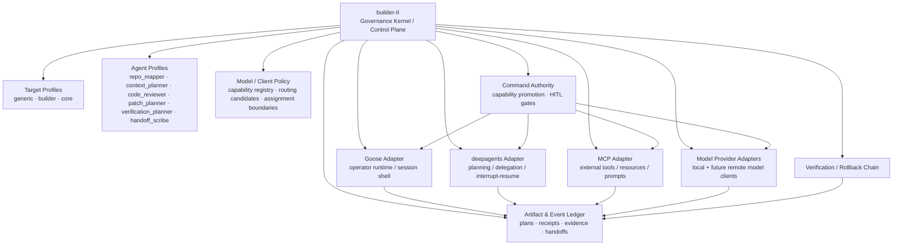

# builder-II

`builder-II` is a generic governed platform for local agent-assisted software development.

It is CORE-born, Codename-Goose-reinforcing, generic-first, engineer-centered, and governed by the Builder's Signet. CORE is supported as a first-class target profile, but builder-II itself is not CORE, not the CORE runtime, not CORE Workbench/UI, and not a second CORE runtime.

builder-II exists to make powerful local agent-assisted engineering work safer, clearer, more reproducible, and more honest about authority. It brings the right repo context, target profile, agent profile, model lane, verification path, authority boundary, audit trail, and handoff structure to the operator before the operator has to reconstruct that state manually.

The project is being built to be freely usable. It does not need hype to justify itself; the facts of the system are the pitch: explicit authority, durable artifacts, human approval where authority changes, verification before promotion, and rollback paths when work touches real code.

See [`docs/MANIFESTO.md`](docs/MANIFESTO.md) for the product philosophy, [`docs/adrs/ADR-0001-core-builder-ii-governed-engineering-extension.md`](docs/adrs/ADR-0001-core-builder-ii-governed-engineering-extension.md) for the governing product decision, and [`docs/adrs/ADR-0002-builder-convention-layer-over-codename-goose.md`](docs/adrs/ADR-0002-builder-convention-layer-over-codename-goose.md) for the Codename Goose convention-layer decision.

## The core architecture

builder-II is the overarching governed control plane.

Goose, deepagents, MCP, and model clients are not parallel sources of authority beside builder-II. They are pressed into builder-II through governed adapters, policy artifacts, event sinks, and approval boundaries.

```text
Wrong shape:
  Goose does some things.
  deepagents does some things.
  MCP tools do some things.
  builder-II later audits whatever it can see.

Right shape:
  builder-II defines the governed envelope.
  Goose operates inside that envelope.
  deepagents plans/delegates inside that envelope.
  MCP capabilities are inventoried, gated, wrapped, and audited inside that envelope.
  Model clients propose/review/plan inside that envelope.
  Every authority-bearing action crosses builder-II policy, artifact, HITL, receipt, verification, and rollback boundaries.
```

Every layer may provide mechanics. Only builder-II provides authority.



### How to read the diagram

- **builder-II is the system.** It owns governance, authority boundaries, artifacts, promotion, verification, rollback, and handoff continuity.
- **Goose is the operator runtime adapter.** Goose supplies local session/runtime mechanics inside a builder-II-defined envelope. Goose must not invent authority.
- **deepagents is the planning/delegation adapter.** deepagents may eventually provide graph planning, subagent decomposition, interrupt/resume, and planning middleware. It must not bypass builder-II policy or treat subagent output as authority.
- **MCP is the external capability adapter.** MCP can expose tools, resources, prompts, roots, elicitation, and sampling surfaces. builder-II must inventory, classify, gate, wrap, audit, and revoke those capabilities.
- **Model clients are reasoning/proposal adapters.** Models may review, plan, summarize, propose, and explain. A model output is not approval, verification, promotion, or truth by itself.

builder-II knows what is happening across layers because capability-bearing actions must pass through builder-II-defined adapters, artifacts, policy checks, and event records. It does not rely on trust that a layer "probably did the right thing." It records what was requested, what policy applied, what was approved or blocked, what executed, what evidence came back, what verification followed, and what rollback path exists.

## The governing distinctions

builder-II is designed around distinctions that agent systems often blur:

- **planned** is not **executed**;
- **executed** is not **verified**;
- **verified** is not **promoted**;
- **artifact** is not **authority**;
- **model output** is not **approval**;
- **subagent output** is not **truth**;
- **approval** is not **successful execution**;
- **execution** is not **safe merge**.

These are not philosophical decorations. They are implementation boundaries.

The platform is meant to become powerful because it is governed: ambient and anticipatory where the work is context, preparation, planning, routing, verification planning, and handoff continuity; explicit and HITL-gated where authority changes.

## The Builder's Signet

Every architectural decision in builder-II should reflect three engineering pillars inherited from CORE:

1. **Mechanical Sympathy** — Respect the real substrate of engineering work: local repositories, Git, Codename Goose, tests, diffs, handoffs, PRs, failed checks, constrained hardware, and human judgment. Do not rebuild what already works. Reinforce it.
2. **Semantic Rigor** — Preserve exact meaning across every artifact and claim. Planned is not executed. Executed is not verified. Verified is not promoted. A manifest is not runtime evidence. A handoff is not proof of correctness.
3. **The Third Door** — Reject the false choice between weak safety theater and reckless automation. builder-II must become powerful because it is governed: every capability that changes authority needs docs, tests, command surface, failure mode, human approval boundary, output artifact, rollback path, and verification path.

These are not slogans. They are design constraints.

## Layer integration model

### builder-II

builder-II owns the platform contract:

- target repositories and target profiles;
- agent profiles and authority contracts;
- model/client metadata and routing policy artifacts;
- context packs and repo maps;
- command authority tiers;
- capability promotion records;
- HITL gates;
- execution requests and receipts;
- evidence bundles and chain bindings;
- verification records;
- rollback artifacts;
- handoff notes.

No integration layer gets to override this contract.

### Goose

builder-II wraps Goose as the approved operator runtime substrate.

Goose is valuable because it is already built for local operator-facing agent sessions. builder-II should reinforce that instead of rebuilding it. Goose may host runtime sessions, present gates, and carry operator interaction, but it should consume builder-II session manifests and linked policy artifacts rather than deciding authority on its own.

### deepagents

builder-II admits deepagents as an optional governed inner orchestration harness.

deepagents is a strong fit for planning graphs, subagent decomposition, TODO planning, interrupt/resume behavior, and structured delegation. Inside builder-II, those features must flow through builder-II work artifacts, assignment artifacts, policy records, and result-review boundaries.

Subagent output remains proposal/evidence unless a separate builder-II review and promotion path says otherwise.

### MCP

builder-II treats MCP as the external capability seam.

MCP can make tools and context easier to connect. That same convenience makes it a potential bypass if it is not governed. builder-II therefore treats MCP capabilities as inventory-first, deny-by-default surfaces: hash them, classify them, gate them, wrap them, audit them, and revoke them when needed.

MCP should make external capabilities easier to govern, not easier to hide.

### Models and providers

builder-II treats local and future remote models as model/provider adapters.

Models may help reason, propose, review, plan, summarize, and explain. They must not silently become approvers, verifiers, command authorities, patch appliers, or promotion engines. Future model routing begins as policy and artifact metadata before it becomes execution behavior.

## Canonical Goose references

Keep the public Goose docs close during design and implementation:

- Goose docs: <https://goose-docs.ai/>
- Agentic AI Foundation: <https://aaif.io/>

The builder convention layer should track Goose's official docs as Goose evolves under AAIF and prefer Goose-native concepts over invented substitutes.

## Documentation map

| Document | Purpose |
| --- | --- |
| [`docs/MANIFESTO.md`](docs/MANIFESTO.md) | builder-II manifesto: signet, product ethos, Codename Goose relationship, and governed engineering promise. |
| [`docs/GOOSE_CONVENTION_LAYER.md`](docs/GOOSE_CONVENTION_LAYER.md) | Operational spec for the builder convention layer over Codename Goose. |
| [`docs/adrs/ADR-0001-core-builder-ii-governed-engineering-extension.md`](docs/adrs/ADR-0001-core-builder-ii-governed-engineering-extension.md) | Architecture decision defining CORE builder-II as a governed engineering extension. |
| [`docs/adrs/ADR-0002-builder-convention-layer-over-codename-goose.md`](docs/adrs/ADR-0002-builder-convention-layer-over-codename-goose.md) | Architecture decision requiring builder-II abstractions to compile down to Codename-Goose-native surfaces. |
| [`docs/PROJECT_OVERVIEW.md`](docs/PROJECT_OVERVIEW.md) | Plain-English overview of the CORE-born, generic-first governed platform and its components. |
| [`docs/OPERATOR_GUIDE.md`](docs/OPERATOR_GUIDE.md) | Setup, daily workflow, Goose recipes, skills/extensions, and validation boundary. |
| [`docs/OPERATOR_COMMAND_SURFACE.md`](docs/OPERATOR_COMMAND_SURFACE.md) | Canonical index of all operator-facing commands, authority tiers, and output artifacts. |
| [`docs/TARGETS.md`](docs/TARGETS.md) | Explicit target profiles: generic, builder, and core. |
| [`docs/AGENTS.md`](docs/AGENTS.md) | Generic agent profiles and authority contracts. |
| [`docs/REPO_MAPS.md`](docs/REPO_MAPS.md) | Repo map artifact creation and validation. |
| [`docs/CONTEXT_PACKS.md`](docs/CONTEXT_PACKS.md) | Context pack artifact creation and validation. |
| [`docs/TARGET_BUNDLES.md`](docs/TARGET_BUNDLES.md) | Governed target bundle JSON artifact creation and validation. |
| [`docs/VERIFICATION_PROFILES.md`](docs/VERIFICATION_PROFILES.md) | Target-scoped verification profile artifacts and validation. |
| [`docs/PROFILE_PACKS.md`](docs/PROFILE_PACKS.md) | Passive profile-pack manifests, render plans, dry-runs, and validation reports for capability-factory composition. |
| [`docs/QUALITY_GATES.md`](docs/QUALITY_GATES.md) | Artifact-only quality gate planning and validation. |
| [`docs/HANDOFF_ARTIFACTS.md`](docs/HANDOFF_ARTIFACTS.md) | Artifact-only handoff capture and validation. |
| [`docs/RESEARCH_PLANS.md`](docs/RESEARCH_PLANS.md) | Artifact-only research planning and source-strategy boundaries. |
| [`docs/PLATFORM_COMPLETION_AUDIT.md`](docs/PLATFORM_COMPLETION_AUDIT.md) | R0 truth matrix mirror, platform status boundary, and docs truth audit entrypoint. |
| [`docs/GOOSE_RUNTIME.md`](docs/GOOSE_RUNTIME.md) | Goose runtime design boundary and promotion requirements. |
| [`docs/GOOSE_SESSION.md`](docs/GOOSE_SESSION.md) | Goose session manifest artifacts; no runtime activation. |
| [`docs/GOOSE_READONLY.md`](docs/GOOSE_READONLY.md) | Goose read-only runtime candidate audit artifacts; no repository inspection yet. |
| [`docs/GOOSE_INSPECTION.md`](docs/GOOSE_INSPECTION.md) | Bounded read-only inspection artifacts for explicit operator-requested files. |
| [`docs/DEEPAGENTS_POLICY.md`](docs/DEEPAGENTS_POLICY.md) | Governed deepagents policy artifacts; no agent construction. |
| [`docs/DEEPAGENTS_READINESS.md`](docs/DEEPAGENTS_READINESS.md) | Optional deepagents bridge readiness reports; no runtime authority. |
| [`docs/plan/GOOSE_DEEPAGENTS_MCP_SEAM.md`](docs/plan/GOOSE_DEEPAGENTS_MCP_SEAM.md) | Design-only seam for Goose as operator runtime, deepagents as governed inner harness, and MCP as policy-gated external capability surface. |
| [`docs/CAPABILITY_PROMOTION.md`](docs/CAPABILITY_PROMOTION.md) | Capability promotion states and non-authority rule. |
| [`docs/RUNTIME_PROMOTION.md`](docs/RUNTIME_PROMOTION.md) | Runtime-specific promotion gates for Goose, deepagents, commands, and patches. |
| [`docs/ARTIFACT_INDEX.md`](docs/ARTIFACT_INDEX.md) | Index of all registered artifact kinds and non-authority boundaries. |
| [`docs/RELEASE_PROOF.md`](docs/RELEASE_PROOF.md) | v0 release proof harness documentation and operator run instructions. |
| [`docs/TOOLING.md`](docs/TOOLING.md) | Tier 1/Tier 2 external engineering tools and Markdown vault strategy. |
| [`docs/ROADMAP.md`](docs/ROADMAP.md) | Scope, non-goals, and near-term platform direction. |
| [`docs/plan/MASTERPIECE_PLAN.md`](docs/plan/MASTERPIECE_PLAN.md) | End-to-end implementation vision. |
| [`docs/plan/PERFORMANCE_AND_EFFICIENCY_AMENDMENT.md`](docs/plan/PERFORMANCE_AND_EFFICIENCY_AMENDMENT.md) | Performance, model routing, and integration amendment. |
| [`docs/model_role_matrix.md`](docs/model_role_matrix.md) | Model aliases, runtime lanes, recommended use, and avoid boundaries. |
| [`docs/lane_guides.md`](docs/lane_guides.md) | Reusable prompt lanes for direct ask and planning/review work. |
| [`docs/personas.md`](docs/personas.md) | Read-only persona definitions. |
| [`docs/role_gates.md`](docs/role_gates.md) | Capability boundaries for each persona. |
| [`docs/lane_checks.md`](docs/lane_checks.md) | Offline consistency checks for role/lane/gate wiring. |

## Hardware target

Primary target: Apple Silicon MacBook Pro M1 with 16GB unified memory.

The machine does not have 16GB free for weights. macOS, Goose, Python, terminal buffers, repository context, and KV cache all share the same memory pool. Productive coding sessions should prefer roughly 2GB to 7GB model footprints. Larger models are available as explicit opt-in experiments, not defaults.

## What Is Present

builder-II v0 includes a passive governed artifact foundation.

Legacy operator-managed helpers remain explicit and separate:

- CLI setup/doctor/status/model helpers through `builder`
- MLX-LM backend startup and served-model checks through operator invocation
- Direct local ask through an OpenAI-compatible local endpoint
- Runtime marker and listener reset helpers
- Goose config generation
- Goose recipes for platform, coding, plan, explore, implement, review, verify, and handoff flows
- builder-II skills copied into the selected target repo

Canonical governed passive lanes include:

- Model aliases, runtime policy, and model capability registry artifact
- Explicit target profiles (`generic`, `builder`, `core`) via `builder-targets`
- Generic agent profiles via `builder-agent`
- Profile resolution layer (target, agent, prompt, verification, context)
- **Session preparation lane** via `builder-session`:
  - `prepare-package` — composes all session artifacts into a governed package
  - `validate-prepare-package` — SHA-256 integrity check on all artifact refs
  - `summarize-prepare-package` — human-readable package summary
  - `repo-map` — read-only filesystem scan artifact
  - `context-pack` — high-signal context subset artifact
  - `config` — session configuration spine artifact
  - `goose-projection` — Goose-native projection artifact (PLANNED_ONLY)
  - `goose-wrapper-plan` — operator-facing wrapper plan artifact
  - `goose-readonly-plan` — read-only session plan rendering
- **ConventionKernel platform spine** — governed composition of the full session artifact set
- **Command authority tier registry** — explicit authority tier, write boundary, and approval requirement for every command
- **Orchestration plan and dry-run** via `builder-orchestration`
- **HITL governance chain** via `builder-hitl`:
  - execution request/receipt records
  - postflight/verification records
  - evidence bundle
  - chain binding (cryptographic lifecycle)
  - approved verification execution candidate
- Verification profile reports via `builder-verification`
- Handoff note lifecycle via `builder-notes`
- Passive profile-pack lifecycle via `builder-profile-pack`
- Passive model client registry and routing policy via `builder-model-policy`
- Platform truth matrix, status, and docs audit via `builder-platform`
- deepagents bridge readiness reports via `builder-deepagents`
- Artifact index and chain verification (all v0 kinds registered, closure-tested)
- **v0 release manifest and operator-run proof harness** (`scripts/verify_v0_release.py`)
- Governed target bundle artifacts via `builder-bundle`
- Quality gate artifacts via `builder-quality`
- Research planning artifacts via `builder-research`
- Lane guides, personas, and capability boundaries for prompt/task organization
- External tool registry via `builder-tools`
- Optional external tool installer via `scripts/install-tools.sh`
- Repomix-backed context manifests via `builder-context`

## Recommended model lanes

| Lane | Alias | Default repo | Purpose |
|---|---|---|---|
| Fast logic/review | `phi-reasoning` | `mlx-community/Phi-4-mini-reasoning-4bit` | Invariant checks, audits, explanations, proposal review. |
| Implementation | `qwen-coder` | `mlx-community/Qwen2.5-Coder-7B-Instruct-4bit` | Targeted patches, tests, CLI wiring, bounded refactors. |

Alternates: `gemma-fast`, `gemma-primary`, and `llama`.

Explicit opt-in candidate lanes: `codegeex`, `qwen-coder-14b`, `qwen3-coder-heavy`, and `deepseek`.

See [`docs/model_role_matrix.md`](docs/model_role_matrix.md) for the canonical operating matrix covering each alias, runtime, role, recommended use, and avoid boundary.

Future hybrid local/frontier routing must begin as a governed policy artifact. It must not silently call external models or bypass target profiles, approvals, audit artifacts, or verification requirements.

## Current validation boundary

Validated on the M1 `mlx-lm` lane:

- `builder doctor` configuration/compliance checks
- MLX-LM backend startup
- Health probe at `http://127.0.0.1:8080/v1/models`
- OpenAI-compatible chat transport at `http://127.0.0.1:8080/v1/chat/completions`
- Direct local ask through `builder ask`
- Text-only audit/planning responses through `qwen-coder`
- Runtime reset with `builder-runtime reset`
- Goose recipe path wiring
- Full `builder-session prepare-package` → `validate-prepare-package` → `summarize-prepare-package` lane
- Repo map and context pack generation
- Session configuration, Goose projection, wrapper plan, and read-only plan artifacts
- ConventionKernel platform spine composition
- HITL execution request/receipt, postflight, verification, evidence bundle, and chain binding artifacts
- HITL approved verification execution candidate (candidate only — no execution performed)
- Handoff note lifecycle artifacts
- deepagents bridge readiness reports
- Artifact index and chain verification (all v0 kinds)
- v0 release proof harness (`uv run python scripts/verify_v0_release.py`)

Not yet promoted (requires capability promotion gate):

- Actual read-only repository inspection at runtime
- Fully autonomous Goose tool execution through the local `mlx-lm` provider
- Goose process-backed runtime inspection
- File-modifying sessions driven by a local MLX model
- HITL command proposal → approved execution (candidate exists, execution not crossed)
- HITL patch proposal → approved application
- deepagents runtime orchestration
- Model/provider execution gateway; passive model registry and routing artifacts exist through `builder-model-policy`
- MCP inventory/policy/enforcement runtime
- Production-quality multimodal sidecar support

Until a dedicated promotion path proves otherwise, treat local MLX sessions as review/planning/reporting lanes. For code edits, require explicit human review and run deterministic verification before accepting changes.

## Install

```bash
brew install block-goose-cli
cd builder-II
uv sync
cp .env.example .env
```

Edit `.env` for target repo paths as needed. If using the `core` target, set the CORE repo path explicitly when it is not at `../core`.

```bash
CORE_REPO_PATH=../core
CORE_AGENT_BACKEND=mlx-lm
CORE_AGENT_MODEL_ALIAS=qwen-coder
```

## Download models

The governed downloader is resumable. Re-run the same command after Wi-Fi drops or Hugging Face throttling.

```bash
bash scripts/pull-roster.sh status
bash scripts/pull-roster.sh recommended
```

Useful variants:

```bash
bash scripts/pull-roster.sh fast
bash scripts/pull-roster.sh primary
bash scripts/pull-roster.sh all-safe
bash scripts/pull-roster.sh alias llama
bash scripts/pull-roster.sh candidates
```

## First run

```bash
builder setup
builder doctor
builder models
builder-targets validate
builder-targets list
builder-agent validate
builder-agent profiles
bash scripts/install-tools.sh required
builder-tools check --tier tier1

# Run the v0 proof harness
uv run python scripts/verify_v0_release.py

# Inspect the R0 platform truth state
builder-platform matrix
builder-platform status
builder-platform audit-docs

# Prepare a governed session package
builder-session prepare-package --target builder --task "audit the selected target repo and identify the safest next patch" --output .builder/session/
builder-session validate-prepare-package .builder/session/
builder-session summarize-prepare-package .builder/session/
```
