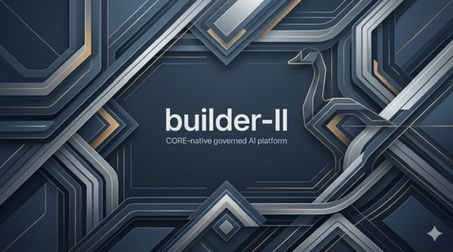

# builder-II

[](https://opensource.org/licenses/MIT)
[](https://www.python.org/downloads/release/python-3120/)

> **Trust signals:** `tests/scenarios/test_wrp_full_lane.py`, `tests/scenarios/test_hitl_patch_lane_unmocked.py`, and `tests/scenarios/test_hitl_orchestration.py` exercise live model gateway routing, unmocked patch apply/rollback, and full HITL orchestration. Canonical local CI truth: `bash scripts/ci.sh` (do not treat badges as a substitute for the local gate battery).

<p align="center">
  
</p>

<p align="center"><em>Opening splash artwork from the governed builder-II TUI.</em></p>

---

## 1. What is builder-II?

> **builder-II is a local-first governed engineering control plane for agent-assisted software development. It lets models, subagents, runtimes, and external tools help aggressively without silently inheriting the authority to decide what is allowed, what is true, or what is finished.**

To understand builder-II, clarify the boundaries immediately:

```text
builder-II ≠ CORE (CORE is an originating design lineage and a first-class target profile)
builder-II ≠ CORE Workbench (builder-II helps build target code, not drive UI workflows)
builder-II ≠ An autonomous engineer (builder-II is a governed control plane, not an unchecked bot)

Goose       = Governed operator runtime adapter (local session mechanics & shell)
Deep Agents = Governed orchestration adapter (bounded planning, graph decomposition, delegation)
MCP         = Governed external capability seam (inventory-first, deny-by-default tools & prompts)
Models      = Reasoning and proposal resources operating strictly behind policy
```

Every layer supplies mechanics. Builder-II represents, constrains, binds, and enforces authority; consequential human decisions originate with the operator.

---

## 2. Why builder-II exists

Today's AI coding assistants and agent systems are remarkably capable, but standard conversational loops collapse five fundamentally distinct concepts into one opaque step:

```text
Ordinary Agent Loop (Collapsed):
  Reason → Choose Tools → Act → Decide Action Was OK → Decide It Worked → Continue
```

When things go wrong in a complex engineering task — across multiple files, long sessions, cloud model providers, external tool invocations, Git operations, and release workflows — this collapsed loop produces:
- **Invisible Agent Authority:** Silent writes, uncontrolled shell executions, and unprompted commits.
- **Context Fog:** Loss of intent and evidence across agent subtasks or multi-session handoffs.
- **False Completion:** A model declaring a patch "done and verified" when tests never ran or failed silently.
- **Unrecoverable State:** Code mutations without verifiable preflight snapshots, working-tree drift detection, or clean rollback paths.

### Governed Engineering as the Solution

builder-II explicitly separates understanding, intent, authorization, execution, evidence, verification, and delivery into discrete, auditable steps:

```text
Governed Engineering Loop:
  Understand
  → Plan
  → Bind Exact Intent
  → Validate
  → Authorize (where authority changes)
  → Execute (through a single bounded owner)
  → Receipt (what actually occurred)
  → Verify (against explicit profiles)
  → Deliver (separately authorized Git effects)
  → Promote / Release (only under later human decisions)
```

---

## 3. The Mental Model

The entire platform is built upon four load-bearing distinctions:

```text
PLANNED ≠ EXECUTED
EXECUTED ≠ VERIFIED
VERIFIED ≠ PROMOTED

ARTIFACT ≠ AUTHORITY
MODEL OUTPUT ≠ APPROVAL
SUBAGENT OUTPUT ≠ TRUTH

LOCAL COMMIT ≠ PUSH
PUSH ≠ PR CREATION
PR CREATION ≠ REVIEW
REVIEW ≠ PROMOTION
PROMOTION ≠ RELEASE
```

These are not slogans; they are deterministic system boundaries. Consider how a standard code modification flows through builder-II:

```text
1. A model proposes a patch artifact.
   ↓ (That is not permission to apply it.)

2. A human operator approves the exact SHA-256 patch digest at an interactive TTY prompt.
   ↓ (That is not proof the patch works.)

3. The patch is applied to a scratch repository or worktree, generating a preflight snapshot and reverse patch.
   ↓ (That is not verification.)

4. A verification runner executes fixed test commands on the exact resulting source code and emits an execution receipt.
   ↓ (That is not permission to commit or push.)

5. The operator approves a local commit.
   ↓ (A local commit is not a push to remote.)

6. Pushing to a remote branch and opening a Pull Request require separate, explicit human authorizations.
```

### What this buys an engineer:
- **Reproducibility:** Meaningful governed transitions emit typed evidence where the owning capability contract requires it.
- **Recoverability:** The HITL patch-application lane creates digest-bound rollback and reverse-patch evidence; other mutation lanes use their own documented recovery models.
- **Inspectable Intent:** Plans, context packs, and routing recommendations are reviewable before any action is executed.
- **Attributable Decisions:** Standing ratification records prove exactly who approved what, when, and under which digest.
- **Aggressive Automation:** Routine steps (repo mapping, context assembly, model routing, artifact validation) run automatically *because* consequential boundaries (mutation, shell, spend, Git) remain strictly guarded.

---

## 4. The Builder's Signet

Every architectural decision in builder-II is governed by three foundational engineering pillars:

### I. Mechanical Sympathy
Respect the physical and software substrate of engineering work. Target the developer's real machine (MacBook Pro Apple Silicon M1/M2/M3 with unified memory) with lean model footprints (2GB–7GB). Integrate with tools that already work (Git, Codename Goose, `uv`, `pytest`) rather than reinventing them. Never hide Git state or invent simulated verification.

### II. Semantic Rigor
Preserve exact meaning across every artifact, profile, session, command, and claim. A plan is not execution. A valid schema is not proof of correct code. An unexecuted test must honestly state `NOT_RUN` or `BLOCKED`. Never permit ambiguous or unverified work to masquerade as completed engineering truth.

### III. The Third Door
Reject the false dichotomy of agent tooling:
- **Door 1:** "Safe" tooling that is useless because the agent can barely do anything.
- **Door 2:** Powerful autonomous tooling that recklessly blurs reasoning, permission, mutation, and verification.
- **The Third Door:** **Powerful because governed.** Automate aggressively where authority does not change; place explicit, tamper-evident friction exactly where a consequential decision occurs; preserve verifiable evidence before and after every transition.

---

## 5. System Architecture

```text
                         HUMAN OPERATOR
                               │
                           builder-II
                   Governed Engineering Plane
                               │
       ┌───────────────────────┼───────────────────────┐
       │                       │                       │
 Context & State      Authority & Evidence         Execution
       │                       │                       │
 Target Profiles         HITL Gates              Model Gateway
 Repository Maps         Receipts Ledger         Goose Adapter
 Context Packs           Verification Runner     Deep Agents
 Handoff Notes           Rollback Engine         MCP Seam
 Artifact Memory         Ratification Grants     Git Delivery
```

### The Recurring Platform Grammar

Across all subsystems, builder-II enforces a single, consistent verb grammar:

$$\text{Artifact} \longrightarrow \text{Validate} \longrightarrow \text{Approve (HITL)} \longrightarrow \text{Execute} \longrightarrow \text{Receipt} \longrightarrow \text{Verify} \longrightarrow \text{Handoff / Delivery}$$

1. **Artifact:** A typed Pydantic/dataclass record (`kind`) with strict schema validation.
2. **Validate:** Schema, digest, and cross-reference integrity checks that fail closed.
3. **Approve:** Human-in-the-loop gate required for any authority-changing operation.
4. **Execute:** Bounded execution via fixed argv (`shell=False`) or sealed adapters.
5. **Receipt:** Cryptographically bound on-disk record of what actually executed and what output resulted.
6. **Verify:** Exact-source check comparing preflight and postflight states.
7. **Handoff / Delivery:** Explicit summary for session resumption or separately authorized Git publishing.

---

## 6. A Five-Minute Taste

Inspect what is true in your environment without starting agents or mutating source code:

```bash
# 1. Ask the platform what is operationally verified vs passive foundation
uv run builder-platform status
uv run builder-platform matrix

# 2. Inspect available target repository profiles
uv run builder-targets list

# 3. Prepare a deterministic session package (repo map, context pack, workflow plan)
uv run builder-session prepare-package generic \
  --task "Audit auth module and draft verification plan" \
  --output-dir .builder/session/

# 4. Validate the SHA-256 integrity of the emitted package
uv run builder-session validate-prepare-package .builder/session/
uv run builder-session summarize-prepare-package .builder/session/
```

### Next Steps:
- **Quick Mechanics:** [`QUICKSTART.md`](QUICKSTART.md) — 60-second setup and verification commands.
- **Full Governed Loop:** [`FIRST_SESSION.md`](FIRST_SESSION.md) — 30-minute end-to-end patch proposal, interactive approval, application, verification, and rollback loop.
- **Conceptual Deep-Dive:** [`docs/GETTING_STARTED.md`](docs/GETTING_STARTED.md) — Comprehensive operator walkthrough, STRATUM navigation, and mental model.

---

## 7. Major Capabilities Overview

| Capability | Why It Exists | Use It When |
|---|---|---|
| **Target Profiles** | Makes repo-specific conventions, sensitive modules, and test commands explicit | Switching projects (`generic`, `builder`, `core`) |
| **Repo Maps & Context Packs** | Provides high-signal, bounded file context subsets without token waste | Starting or resuming an engineering task |
| **Agent Profiles** | Separates persona, prompt rules, and allowed tools from execution authority | Selecting mapper, reviewer, planner, or scribe roles |
| **Model Routing & WRP** | Determines optimal model, tier, provider, and budget policy before invocation | Planning local vs frontier reasoning workloads |
| **Model Execution Gateway** | Single governed gateway for local/cloud inference with receipts and cost tracking | Running text or code completions through policy |
| **Deep Agents** | Structured task decomposition, work plans, and subagent obligations | Breaking down multi-step architectural changes |
| **Goose Adapter** | Preferred local operator runtime for interactive, recipe-driven coding sessions | Pairing interactively with an AI coding partner |
| **MCP / Tool Gateway** | Brings external tools and prompts into an inventory-first, deny-by-default policy | Integrating custom dev tools or domain APIs |
| **HITL Approval Gates** | Binds human decisions to exact SHA-256 digests via interactive TTY prompts | Authorizing patches, rollbacks, or spend |
| **Verification Runner** | Executes an exact approved verification profile and records what passed or failed; it does not prove general program correctness | Testing before patch apply, commit, or push |
| **Rollback Engine** | Treats reversal as a first-class governed mutation with drift detection | Reverting an applied patch cleanly |
| **Ratification Grants** | Relocates re-confirmation friction without delegating human approval authority | Streamlining repetitive operator commands |
| **STRATUM Console** | TUI instrument console for observing artifact chains, matrices, and composing CLI lines | Navigating platform state from a central terminal UI |
| **Artifact Memory & Handoffs** | Content-addressed, reviewable memory atoms and handoffs across sessions | Preserving context across interruptions or handoffs |
| **Release Proof Harness** | Binds release artifacts to exact byte snapshots and verifiable manifests | Qualifying a candidate release before tagging |

---

## 8. What "Governed" Does and Does NOT Mean

Maintaining semantic rigor requires being completely explicit about security and trust boundaries:

### Governed DOES mean:
- **Policy-Bound:** Actions must conform to declared target, agent, tool, and model policies.
- **Digest-Bound:** Approvals and receipts bind the cryptographic hash (SHA-256) of input artifacts.
- **Explicit Authority Transitions:** Authority never transfers implicitly across an integration seam.
- **Fail-Closed Behavior:** Malformed artifacts, digest mismatches, or missing gates immediately halt execution.
- **Durable Audit Trails:** State transitions append to hash-chained event ledgers.
- **Reversible Mutations:** Code edits generate working-tree snapshots and reverse patches.

### Governed does NOT automatically mean:
- **A Sandbox:** The bounded verification runner executes target repository code with the operator's host privileges. It constrains *invocation* (fixed argv, environment allowlist, `shell=False`, timeout), **not what invoked code can do**. Never run verification on untrusted repositories.
- **Autonomous Software Engineer:** builder-II will not independently invent tasks, approve its own diffs, or push code.
- **Cryptographic Non-Repudiation:** Audit ledgers are tamper-evident under later inspection, not immutable blockchain ledgers.
- **Safe for Untrusted Prompts:** Model output is always treated as unverified proposal text.

---

## 9. Human Authority Without Constant Friction

builder-II distinguishes between two types of confirmation:

```text
"This is the artifact I already authored/reviewed"  →  DELEGABLE via Standing Ratification Grant
"Should this consequential action be approved?"     →  CAN NEVER BE DELEGATED (Human Decision)
```

- **Interactive HITL Prompts:** When approving a patch or rollback, the operator must type the first characters of the artifact's SHA-256 digest at a TTY prompt. There is no `--yes` flag on approval minting.
- **Standing Ratification Grants (`builder onboard` / `builder-govern`):** An operator can delegate re-confirmation friction for routine setup applications to a revocable, ledgered standing grant.
- **Tighten-Only Policy Ladder:** Policy can raise confirmation requirements (`delegable` $\rightarrow$ `always_prompt` $\rightarrow$ `require_approval_artifact`), but can never loosen an ungrantable HITL gate.

See [`docs/RATIFICATION_GRANTS.md`](docs/RATIFICATION_GRANTS.md) for full doctrine.

---

## 10. Model & Runtime Architecture

builder-II does not hardcode static lists of models into documentation. Model backends and routing rules operate through a unified gateway:

```text
Task Intent & Risk Budget
  ↓
Model Routing Recommendation (`builder-model-policy`)
  ↓
Immutable Route Binding
  ↓
Model Execution Gateway (`builder_ii.routing.model_execution_gateway`)
  ↓
Transport Adapter (Local MLX / Ollama / Cloud Vertex / OpenAI-Compatible)
  ↓
Receipt & Budget Successor Record
```

- **Passive model client registry and routing policy via `builder-model-policy`**
- **Model/provider execution gateway** with budget caps and cost tracking
- **Live Model Discovery:** Run `builder models` or `builder-model-policy show` to inspect currently configured backends, served models, and routing recommendations.

See [`docs/MODEL_COSTING.md`](docs/MODEL_COSTING.md) and [`docs/model_role_matrix.md`](docs/model_role_matrix.md).

---

## 11. Git Delivery & Release Workflow

builder-II enforces strict separation between local modifications and remote publication:

```text
1. Propose Patch Artifact
      ↓
2. Approve Patch Digest (HITL)
      ↓
3. Apply Patch (Local Scratch / Worktree)
      ↓
4. Run Exact-Source Verification (`builder-verify run-approved`)
      ↓
5. Operator Approves Local Commit
      ↓
6. Execute Git Commit
      ↓
7. Re-Verify Exact Commit Tip
      ↓
8. Operator Approves Remote Push
      ↓
9. Execute Git Push to Feature Branch
      ↓
10. Operator Approves Pull Request Creation
      ↓
11. Pull Request Review & Quality Gates Passing
      ↓
12. Final v1 release-proof qualification (`builder-release` exact-candidate bundle)
```

There is **no automated push to `main`**, no direct force-push happy path, and no unreviewed release promotion.

---

## 12. Supported Environments

### Version 1.0.0 Platform Support Contract:

- **Python Runtime:** `Python >=3.12.13, <3.13` (enforced via `.python-version` and `pyproject.toml`).
- **macOS (Apple Silicon arm64):**
  - **Supported & Primary Performance Target.**
  - Native local model inference via `mlx-lm` (install with `uv sync --extra mlx`).
  - Memory-sympathetic defaults tuned for 16GB unified memory (2GB–7GB models).
- **Linux (x86_64 / aarch64):**
  - **Supported Governance & Runtime Host.**
  - Full CLI, TUI (STRATUM), artifact chain, verification runner, and remote model gateway support.
  - Local model execution supported via Ollama or OpenAI-compatible endpoints (no Apple MLX support).
- **Windows / Windows WSL2:**
  - **Unsupported for v1.0.0.**

---

## 13. Current Platform Status & Verification

builder-II maintains a self-describing, machine-checked truth matrix. At any time, you can audit the operational state of every capability directly from the codebase:

```bash
# Display operational verification status and capability counts
uv run builder-platform status

# Display full completion truth matrix (JSON format)
uv run builder-platform matrix

# Audit documentation against false-completion claims
uv run builder-platform audit-docs
```

- **`OPERATIONALLY_VERIFIED`:** Capability has cleared all eight promotion gates (docs, tests, command surface, failure mode, human boundary, output artifact, rollback path, verification path).
- **`PASSIVE_FOUNDATION` / `ARTIFACT_ONLY`:** Capability produces valid schemas and passive plans, but does not possess runtime execution authority.
- **Known Boundaries:** See [`docs/KNOWN_LIMITATIONS.md`](docs/KNOWN_LIMITATIONS.md) for an exact list of unpromoted capabilities and blockers generated directly from the matrix.

---

## 14. Documentation Journeys

Find the right path for your immediate goal:

```text
┌───────────────────────────────────────┐
│ "I want to try it in 60 seconds"     │ ──► QUICKSTART.md
└───────────────────────────────────────┘
┌───────────────────────────────────────┐
│ "I want to understand the paradigm"   │ ──► docs/MANIFESTO.md + docs/PROJECT_OVERVIEW.md
└───────────────────────────────────────┘
┌───────────────────────────────────────┐
│ "I want to operate it day-to-day"     │ ──► docs/GETTING_STARTED.md + docs/OPERATOR_GUIDE.md
└───────────────────────────────────────┘
┌───────────────────────────────────────┐
│ "I need exact technical truth"        │ ──► docs/README.md + docs/COMMAND_AUTHORITY.md
└───────────────────────────────────────┘
```

- **Contributing Guide:** [`CONTRIBUTING.md`](CONTRIBUTING.md) — Development setup, local CI gates, Forgejo workflow.
- **Security Policy & Threat Model:** [`SECURITY.md`](SECURITY.md) — Vulnerability reporting and trust boundaries.
- **Changelog & Version Provenance:** [`CHANGELOG.md`](CHANGELOG.md) — Version history and release notes.
- **License:** [`LICENSE`](LICENSE) — Open source under the MIT License. Commercial extensions (such as CodeVault) operate under dedicated licensing.

---

<p align="center">
  <b>builder-II</b> — Governed Engineering for Agent-Assisted Development.<br>
  <em>Because powerful AI tooling should make software more reliable, not more opaque.</em>
</p>
