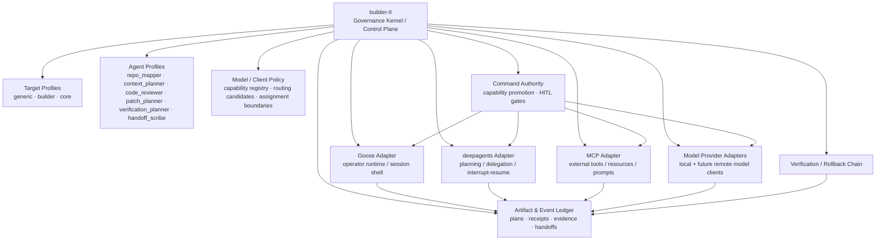

# builder-II

> **Verification:** `bash scripts/ci.sh` is the authoritative local merge gate. This repository does not use GitHub-hosted workflows or status checks.


<p align="center">
  
</p>

<p align="center"><em>Opening splash artwork from the governed builder-II TUI.</em></p>

`builder-II` is a generic governed platform for local agent-assisted software development.

It is CORE-born, Codename-Goose-reinforcing, generic-first, engineer-centered, and governed by the Builder's Signet. CORE is supported as a first-class target profile, but builder-II itself is not CORE, not the CORE runtime, not CORE Workbench/UI, and not a second CORE runtime.

builder-II exists to make powerful local agent-assisted engineering work safer, clearer, more reproducible, and more honest about authority. It brings the right repo context, target profile, agent profile, model lane, verification path, authority boundary, audit trail, and handoff structure to the operator before the operator has to reconstruct that state manually.

The project is being built to be freely usable. It does not need hype to justify itself; the facts of the system are the pitch: explicit authority, durable artifacts, human approval where authority changes, verification before promotion, and rollback paths when work touches real code.

See [`docs/MANIFESTO.md`](docs/MANIFESTO.md) for the product philosophy, [`docs/adrs/ADR-0001-core-builder-ii-governed-engineering-extension.md`](docs/adrs/ADR-0001-core-builder-ii-governed-engineering-extension.md) for the governing product decision, and [`docs/adrs/ADR-0002-builder-convention-layer-over-codename-goose.md`](docs/adrs/ADR-0002-builder-convention-layer-over-codename-goose.md) for the Codename Goose convention-layer decision.

## The core architecture

builder-II is the overarching governed control plane.

Goose, deepagents, MCP, and model clients are not parallel sources of authority beside builder-II. They are pressed into builder-II through governed adapters, policy artifacts, event sinks, and approval boundaries.

```text
Wrong shape:
  Goose does some things.
  deepagents does some things.
  MCP tools do some things.
  builder-II later audits whatever it can see.

Right shape:
  builder-II defines the governed envelope.
  Goose operates inside that envelope.
  deepagents plans/delegates inside that envelope.
  MCP capabilities are inventoried, gated, wrapped, and audited inside that envelope.
  Model clients propose/review/plan inside that envelope.
  Every authority-bearing action crosses builder-II policy, artifact, HITL, receipt, verification, and rollback boundaries.
```

Every layer may provide mechanics. Only builder-II provides authority.



### How to read the diagram

- **builder-II is the system.** It owns governance, authority boundaries, artifacts, promotion, verification, rollback, and handoff continuity.
- **Goose is the operator runtime adapter.** Goose supplies local session/runtime mechanics inside a builder-II-defined envelope. Goose must not invent authority.
- **deepagents is the planning/delegation adapter.** The bounded native lane provides graph planning, WRP-derived subagent decomposition, interrupt/resume, and governance middleware through the official factory. It must not bypass builder-II policy or treat subagent output as authority.
- **MCP is the external capability adapter.** MCP can expose tools, resources, prompts, roots, elicitation, and sampling surfaces. builder-II must inventory, classify, gate, wrap, audit, and revoke those capabilities.
- **Model clients are reasoning/proposal adapters.** Models may review, plan, summarize, propose, and explain. A model output is not approval, verification, promotion, or truth by itself.

builder-II knows what is happening across layers because capability-bearing actions must pass through builder-II-defined adapters, artifacts, policy checks, and event records. It does not rely on trust that a layer "probably did the right thing." It records what was requested, what policy applied, what was approved or blocked, what executed, what evidence came back, what verification followed, and what rollback path exists.

## The governing distinctions

builder-II is designed around distinctions that agent systems often blur:

- **planned** is not **executed**;
- **executed** is not **verified**;
- **verified** is not **promoted**;
- **artifact** is not **authority**;
- **model output** is not **approval**;
- **subagent output** is not **truth**;
- **approval** is not **successful execution**;
- **execution** is not **safe merge**.

These are not philosophical decorations. They are implementation boundaries.

The platform is meant to become powerful because it is governed: ambient and anticipatory where the work is context, preparation, planning, routing, verification planning, and handoff continuity; explicit and HITL-gated where authority changes.

## The Builder's Signet

Every architectural decision in builder-II should reflect three engineering pillars inherited from CORE:

1. **Mechanical Sympathy** — Respect the real substrate of engineering work: local repositories, Git, Codename Goose, tests, diffs, handoffs, PRs, failed checks, constrained hardware, and human judgment. Do not rebuild what already works. Reinforce it.
2. **Semantic Rigor** — Preserve exact meaning across every artifact and claim. Planned is not executed. Executed is not verified. Verified is not promoted. A manifest is not runtime evidence. A handoff is not proof of correctness.
3. **The Third Door** — Reject the false choice between weak safety theater and reckless automation. builder-II must become powerful because it is governed: every capability that changes authority needs docs, tests, command surface, failure mode, human approval boundary, output artifact, rollback path, and verification path.

These are not slogans. They are design constraints.

## Layer integration model

### builder-II

builder-II owns the platform contract:

- target repositories and target profiles;
- agent profiles and authority contracts;
- model/client metadata and routing policy artifacts;
- context packs and repo maps;
- command authority tiers;
- capability promotion records;
- HITL gates;
- execution requests and receipts;
- evidence bundles and chain bindings;
- verification records;
- rollback artifacts;
- handoff notes.

No integration layer gets to override this contract.

### Goose

builder-II wraps Goose as the approved operator runtime substrate.

Goose is valuable because it is already built for local operator-facing agent sessions. builder-II should reinforce that instead of rebuilding it. Goose may host runtime sessions, present gates, and carry operator interaction, but it should consume builder-II session manifests and linked policy artifacts rather than deciding authority on its own.

### deepagents

builder-II admits deepagents as an optional governed inner orchestration harness.

The bounded native lane uses the official `deepagents.create_deep_agent` factory. Every model call passes through `ModelExecutionGateway`; executable tools pass through Builder-II policy; subagents come from sealed WRP obligations; and HITL resume binds to a digest-verified persisted checkpoint. The default is two active workers, the hard cap is four, and the parent and subagents share one model adapter so multiple large local models are never loaded concurrently.

Subagent output remains proposal/evidence unless a separate builder-II review and promotion path says otherwise.

### MCP

builder-II treats MCP as the external capability seam.

MCP can make tools and context easier to connect. That same convenience makes it a potential bypass if it is not governed. builder-II therefore treats MCP capabilities as inventory-first, deny-by-default surfaces: hash them, classify them, gate them, wrap them, audit them, and revoke them when needed.

MCP should make external capabilities easier to govern, not easier to hide.

### Models and providers

builder-II treats local and future remote models as model/provider adapters.

Models may help reason, propose, review, plan, summarize, and explain. They must not silently become approvers, verifiers, command authorities, patch appliers, or promotion engines. Future model routing begins as policy and artifact metadata before it becomes execution behavior.

## deepagents Forge

deepagents Forge is builder-II's interactive creation surface for defining new deepagents without hand-authoring raw YAML. It walks the operator through identity, persona, target profile, capabilities, HITL gates, context, governance, and preview — then emits a governed agent profile in one shot.

Key properties:

- Interactive Textual TUI and headless CLI mode (`--non-interactive`).
- Governance-first: write and shell capabilities require explicit HITL gates before the governance check passes.
- Dry-run safe: `--dry-run` previews the full spec, governance checklist, and profile diff without writing anything.
- Generic-first design: works for any repo; CORE is a target profile, not platform identity.
- Additive: wraps existing `deepagents_bridge` and `agent_profiles` surfaces without replacing them.

```bash
# Interactive TUI wizard
builder-deepagents forge

# Pre-seed name and target profile
builder-deepagents forge --name pr_reviewer --profile core

# Preview only — no writes
builder-deepagents forge --dry-run

# Headless / CI mode
builder-deepagents forge \
  --non-interactive \
  --name test_writer \
  --persona "You are an agent that writes tests." \
  --output-artifact artifacts/test_writer/ \
  --rollback-path rollback/test_writer/
```

See [`docs/DEEPAGENTS_FORGE.md`](docs/DEEPAGENTS_FORGE.md) for the full guide.

## CodeVault (Paid Commercial Plugin Upgrade)

**CodeVault** is a separate, privately licensed commercial plugin. Its implementation, design
records, and development history are not distributed in this repository.

### The CLI Seam in Open Core
The open-source core includes a **fail-closed optional-plugin seam**. When the commercial package
is unavailable, `builder-code-vault` exits non-zero and points the operator to the upgrade boundary.
When installed separately, the seam delegates to the plugin's own command surface.

If you are interested in CodeVault or would like to enquire about getting access to the commercial plugin, please **reach out to the core maintainers** to ask about it!

The optional upgrade URL can be overridden with `CODEVAULT_URL`.

## Supported Models & Execution Backends

`builder-II` stands out by deeply integrating a robust, native registry of over 25+ models across diverse local and cloud execution backends. Unlike generic AI coding tools, `builder-II` classifies, routes, and sandboxes these models through a strict governance gateway to ensure mechanical sympathy and predictable artifact outcomes.

### Local Apple Silicon (M1) Execution
- **MLX Framework (In-Memory)**: Seamless integration with `mlx_lm.server` for high-throughput, low-latency local execution directly on Apple unified memory. Includes natively supported lanes for `mlx-community/Phi-4-mini-reasoning-4bit`, `mlx-community/Qwen2.5-Coder-7B-Instruct-4bit`, and heavy candidate lanes like `Qwen3-Coder-30B` and `DeepSeek-Coder-V2`.
- **Ollama (Local Network)**: Complete integration with the Ollama daemon for running lightweight candidates like `gemma4:e4b`, `qwen3.5:2b`, and `ibm/granite4.1:3b` entirely offline.

### Cloud Egress & Enterprise Execution
- **Google Vertex AI**: Governed integration with Google Cloud Vertex AI using `global` openapi routing. Supports `gemini-3.5-flash`, `gemini-3.1-pro-preview`, and the full Gemini reasoning stack through ADC (Application Default Credentials).
- **Groq & xAI**: Out-of-the-box support for lightning-fast API endpoints routing ultra-heavy frontier models (`Llama-3.3-70b-specdec`, `Grok-4.3`, `gpt-oss-120b`).

Every single backend is automatically governed by `builder-II`'s policy engine, assigning explicit routing rules, `local_network` / `cloud_egress` isolation envelopes, and dynamic tool-use capabilities to each model.

## Canonical Goose references

Keep the public Goose docs close during design and implementation:

- Goose docs: <https://goose-docs.ai/>
- Agentic AI Foundation: <https://aaif.io/>

The builder convention layer should track Goose's official docs as Goose evolves under AAIF and prefer Goose-native concepts over invented substitutes. Goose is Apache 2.0 licensed and is never bundled or redistributed by builder-II — it is installed separately by the operator; see [`NOTICE.md`](NOTICE.md) for the full third-party notice.

## Documentation map

The curated set below covers what most readers need first. For the full reference index of every
tracked document under `docs/`, grouped by subsystem, see [`docs/README.md`](docs/README.md).

| Document | Purpose |
| --- | --- |
| [`FIRST_SESSION.md`](FIRST_SESSION.md) | The single validated path from a clean clone to one complete governed patch loop, in about 30 minutes. Start here. |
| [`docs/MANIFESTO.md`](docs/MANIFESTO.md) | builder-II manifesto: signet, product ethos, Codename Goose relationship, and governed engineering promise. |
| [`docs/HONESTY_PINS_VS_IMPLEMENTATION.md`](docs/HONESTY_PINS_VS_IMPLEMENTATION.md) | Honesty pins reject false claims; they are **not** a ban on implementing governed execution paths. |
| [`docs/GOOSE_CONVENTION_LAYER.md`](docs/GOOSE_CONVENTION_LAYER.md) | Operational spec for the builder convention layer over Codename Goose. |
| [`docs/adrs/ADR-0001-core-builder-ii-governed-engineering-extension.md`](docs/adrs/ADR-0001-core-builder-ii-governed-engineering-extension.md) | Architecture decision defining CORE builder-II as a governed engineering extension. |
| [`docs/adrs/ADR-0002-builder-convention-layer-over-codename-goose.md`](docs/adrs/ADR-0002-builder-convention-layer-over-codename-goose.md) | Architecture decision requiring builder-II abstractions to compile down to Codename-Goose-native surfaces. |
| [`docs/PROJECT_OVERVIEW.md`](docs/PROJECT_OVERVIEW.md) | Plain-English overview of the CORE-born, generic-first governed platform and its components. |
| [`docs/OPERATOR_GUIDE.md`](docs/OPERATOR_GUIDE.md) | Setup, daily workflow, Goose recipes, skills/extensions, and validation boundary. |
| [`docs/OPERATOR_QUICKSTART.md`](docs/OPERATOR_QUICKSTART.md) | Governed operator golden path and governed demo loop entrypoint. |
| [`docs/GETTING_STARTED.md`](docs/GETTING_STARTED.md) | Step-by-step walkthroughs of advanced setup, STRATUM navigation, model configurations, and deepagent orchestration. |
| [`docs/GLOSSARY.md`](docs/GLOSSARY.md) | Centralized definitions for core terminology, harnesses, and operational modes. |
| [`docs/CORE_DEMO_WALKTHROUGH.md`](docs/CORE_DEMO_WALKTHROUGH.md) | Demo recording flow (CORE profile + generic targets) with evidence artifacts, approval boundary, verification, and rollback. |
| [`docs/OPERATOR_COMMAND_SURFACE.md`](docs/OPERATOR_COMMAND_SURFACE.md) | Canonical index of all operator-facing commands, authority tiers, and output artifacts. |
| [`docs/TARGETS.md`](docs/TARGETS.md) | Explicit target profiles: generic, builder, and core. |
| [`docs/architecture/CORE_WORKBENCH_BOUNDARY.md`](docs/architecture/CORE_WORKBENCH_BOUNDARY.md) | V.5: builder-II helps Workbench *code* as target work; is not Workbench (design-only). |
| [`docs/RATIFICATION_GRANTS.md`](docs/RATIFICATION_GRANTS.md) | Standing ratification grants: delegate the confirmations you already decided, never the ones that *are* the decision. `builder onboard` / `builder-govern`. |
| [`docs/AGENTS.md`](docs/AGENTS.md) | Generic agent profiles and authority contracts. |
| [`docs/REPO_MAPS.md`](docs/REPO_MAPS.md) | Repo map artifact creation and validation. |
| [`docs/CONTEXT_PACKS.md`](docs/CONTEXT_PACKS.md) | Context pack artifact creation and validation. |
| [`docs/TARGET_BUNDLES.md`](docs/TARGET_BUNDLES.md) | Governed target bundle JSON artifact creation and validation. |
| [`docs/VERIFICATION_PROFILES.md`](docs/VERIFICATION_PROFILES.md) | Target-scoped verification profile artifacts and validation. |
| [`docs/PROFILE_PACKS.md`](docs/PROFILE_PACKS.md) | Passive profile-pack manifests, render plans, dry-runs, and validation reports for capability-factory composition. |
| [`docs/QUALITY_GATES.md`](docs/QUALITY_GATES.md) | Artifact-only quality gate planning and validation. |
| [`docs/HANDOFF_ARTIFACTS.md`](docs/HANDOFF_ARTIFACTS.md) | Artifact-only handoff capture and validation. |
| [`docs/RESEARCH_PLANS.md`](docs/RESEARCH_PLANS.md) | Artifact-only research planning and source-strategy boundaries. |
| [`docs/PLATFORM_COMPLETION_AUDIT.md`](docs/PLATFORM_COMPLETION_AUDIT.md) | R0 truth matrix mirror, platform status boundary, and docs truth audit entrypoint. |
| [`docs/GOOSE_RUNTIME.md`](docs/GOOSE_RUNTIME.md) | Goose runtime design boundary and promotion requirements. |
| [`docs/GOOSE_SESSION.md`](docs/GOOSE_SESSION.md) | Goose session manifest artifacts; no runtime activation. |
| [`docs/GOOSE_READONLY.md`](docs/GOOSE_READONLY.md) | Goose read-only runtime candidate audit artifacts; no repository inspection yet. |
| [`docs/GOOSE_INSPECTION.md`](docs/GOOSE_INSPECTION.md) | Bounded read-only inspection artifacts for explicit operator-requested files. |
| [`docs/DEEPAGENTS_POLICY.md`](docs/DEEPAGENTS_POLICY.md) | Governed deepagents policy artifacts; no agent construction. |
| [`docs/DEEPAGENTS_READINESS.md`](docs/DEEPAGENTS_READINESS.md) | Optional deepagents bridge readiness reports; no runtime authority. |
| [`docs/architecture/NATIVE_DEEPAGENTS_RUNTIME.md`](docs/architecture/NATIVE_DEEPAGENTS_RUNTIME.md) | Official native Deep Agents adapter, WRP/model/tool/checkpoint boundaries, and executable evidence contract. |
| [`docs/DEEPAGENTS_FORGE.md`](docs/DEEPAGENTS_FORGE.md) | Interactive deepagents Forge wizard: creation flow, governance model, CLI usage, and design boundaries. |
| [`docs/GOOSE_RUNTIME.md`](docs/GOOSE_RUNTIME.md) | Design-only seam for Goose as operator runtime, deepagents as governed inner harness, and MCP as policy-gated external capability surface. |
| [`docs/CAPABILITY_PROMOTION.md`](docs/CAPABILITY_PROMOTION.md) | Capability promotion states and non-authority rule. |
| [`docs/RUNTIME_PROMOTION.md`](docs/RUNTIME_PROMOTION.md) | Runtime-specific promotion gates for Goose, deepagents, commands, and patches. |
| [`docs/ARTIFACT_INDEX.md`](docs/ARTIFACT_INDEX.md) | Index of all registered artifact kinds and non-authority boundaries. |
| `builder_ii/cli/code_vault_cli.py` | CodeVault commercial plugin CLI seam (refuses execution in open core and guides upgrade). |
| [`docs/RELEASE_PROOF.md`](docs/RELEASE_PROOF.md) | v0 release proof harness documentation and operator run instructions. |
| [`docs/BETA_CHARTER.md`](docs/BETA_CHARTER.md) | What the beta is for, what feedback is wanted, what's out of scope, and how to send it. |
| [`docs/TOOLING.md`](docs/TOOLING.md) | Tier 1/Tier 2 external engineering tools and Markdown vault strategy. |
| [`docs/PLATFORM_COMPLETION_AUDIT.md`](docs/PLATFORM_COMPLETION_AUDIT.md) | Scope, non-goals, and near-term platform direction. |
| [`docs/plan/OPEN_SOURCE_V1_COMPLETION_PLAN.md`](docs/plan/OPEN_SOURCE_V1_COMPLETION_PLAN.md) | End-to-end implementation vision. |
| [`docs/PERFORMANCE_MEASUREMENTS.md`](docs/PERFORMANCE_MEASUREMENTS.md) | Performance, model routing, and integration amendment. |
| [`docs/model_role_matrix.md`](docs/model_role_matrix.md) | Model aliases, runtime lanes, recommended use, and avoid boundaries. |
| [`docs/lane_guides.md`](docs/lane_guides.md) | Reusable prompt lanes for direct ask and planning/review work. |
| [`docs/personas.md`](docs/personas.md) | Read-only persona definitions. |
| [`docs/role_gates.md`](docs/role_gates.md) | Capability boundaries for each persona. |
| [`docs/lane_checks.md`](docs/lane_checks.md) | Offline consistency checks for role/lane/gate wiring. |

## Contributing

This repository is currently private and not yet open for external contribution — see
[`CONTRIBUTING.md`](CONTRIBUTING.md) for the (draft) process, quality gates, and conventions, prepared
ahead of open-sourcing. [`SECURITY.md`](SECURITY.md) covers vulnerability reporting and this project's
threat-model boundaries. [`CODE_OF_CONDUCT.md`](CODE_OF_CONDUCT.md) applies to all project spaces.
[`CHANGELOG.md`](CHANGELOG.md) tracks notable changes.

## License

builder-II is licensed under the [MIT License](LICENSE). [`NOTICE.md`](NOTICE.md) documents
third-party software builder-II integrates with (notably Codename Goose, Apache 2.0) and what is
and is not distributed as part of this repository. The commercial [CodeVault](#codevault-paid-commercial-plugin-upgrade)
plugin is a separate repository under its own license and is not covered here.

## Support this project

builder-II is part of the broader CORE research program. If you'd like to support that work
financially:

- [Sponsor on GitHub Sponsors](https://github.com/sponsors/AssetOverflow)
- [Support via Open Collective](https://opencollective.com/assetoverflow-core)

## Hardware target

Primary target: Apple Silicon MacBook Pro M1 with 16GB unified memory.

The machine does not have 16GB free for weights. macOS, Goose, Python, terminal buffers, repository context, and KV cache all share the same memory pool. Productive coding sessions should prefer roughly 2GB to 7GB model footprints. Larger models are available as explicit opt-in experiments, not defaults.

**Non-Mac boundary:** the governed artifact/HITL/verification spine (CLI, TUI, artifact kinds, HITL chain, verification lanes) has no Apple Silicon dependency and installs anywhere `uv sync` runs. The local-model backend (`mlx-lm`/`rapid-mlx`, gated behind the `mlx` extra — see "Install") is Mac-first for beta: MLX requires macOS on arm64, and no non-Mac local-model backend is promoted yet. A non-Mac operator can still exercise the full governance loop against a remote/OpenAI-compatible endpoint or without a live model backend; full Linux CI parity is post-beta ladder work.

## What Is Present

builder-II v0 includes an active governed artifact foundation. It supports governed local model ask, health-probe, and OpenAI-compatible chat-completion transport paths where validated, alongside Goose operator-session launch and recipe path wiring.

Note that operator-managed runtime helpers and manual verification workflows are distinct from promoted autonomous runtime authority, which remains unpromoted. The release proof harness (`scripts/verify_v0_release.py`) serves as a structural artifact/governance validation proof, rather than a live model autonomy or autonomous Goose tool-execution proof.

Legacy operator-managed helpers remain explicit and separate:

- CLI setup/doctor/status/model helpers through `builder`
- MLX-LM backend startup and served-model checks through operator invocation
- Direct local ask through an OpenAI-compatible local endpoint
- Runtime marker and listener reset helpers
- Passive Goose config overlay planning
- Goose recipes for platform, coding, plan, explore, implement, review, verify, and handoff flows
- Passive skill install planning via governed setup overlays

Canonical governed passive lanes include:

- Model aliases, runtime policy, and model capability registry artifact
- Explicit target profiles (`generic`, `builder`, `core`) via `builder-targets`
- Generic agent profiles via `builder-agent`
- Profile resolution layer (target, agent, prompt, verification, context)
- **Session preparation lane** via `builder-session`:
  - `prepare-package` — composes all session artifacts into a governed package
  - `validate-prepare-package` — SHA-256 integrity check on all artifact refs
  - `summarize-prepare-package` — human-readable package summary
  - `repo-map` — read-only filesystem scan artifact
  - `context-pack` — high-signal context subset artifact
  - `config` — session configuration spine artifact
  - `goose-projection` — Goose-native projection artifact (PLANNED_ONLY)
  - `goose-wrapper-plan` — operator-facing wrapper plan artifact
  - `goose-readonly-plan` — read-only session plan rendering
- **ConventionKernel platform spine** — governed composition of the full session artifact set
- **Command authority tier registry** — explicit authority tier, write boundary, and approval requirement for every command
- **Orchestration plan and dry-run** via `builder-orchestration`
- **HITL governance chain** via `builder-hitl`:
  - execution request/receipt records
  - postflight/verification records
  - evidence bundle
  - chain binding (cryptographic lifecycle)
  - approved verification execution candidate
- Verification profile reports via `builder-verification`
- B1.3B verification plan, approval binding, receipt contract, and bounded `platform_status` runner via `builder-verify`
- Handoff note lifecycle via `builder-notes`
- Artifact memory atoms, indexes, deterministic search, and reconstruction via `builder-memory`
- Passive profile-pack lifecycle via `builder-profile-pack`
- Passive model client registry and routing policy via `builder-model-policy`
- Platform truth matrix, status, and docs audit via `builder-platform`
- deepagents bridge readiness reports via `builder-deepagents`
- Artifact index and chain verification (all v0 kinds registered, closure-tested)
- **v0 release manifest and operator-run proof harness** (`scripts/verify_v0_release.py`)
- Governed target bundle artifacts via `builder-bundle`
- Quality gate artifacts via `builder-quality`
- Research planning artifacts via `builder-research`
- Lane guides, personas, and capability boundaries for prompt/task organization
- External tool registry via `builder-tools`
- Optional external tool installer via `scripts/install-tools.sh`
- Repomix-backed context manifests via `builder-context`
- **deepagents Forge** — interactive governed agent creation wizard via `builder-deepagents forge`

## Recommended model lanes

| Lane | Alias | Default repo | Purpose |
|---|---|---|---|
| Fast logic/review | `phi-reasoning` | `mlx-community/Phi-4-mini-reasoning-4bit` | Invariant checks, audits, explanations, proposal review. |
| Implementation | `qwen-coder` | `mlx-community/Qwen2.5-Coder-7B-Instruct-4bit` | Targeted patches, tests, CLI wiring, bounded refactors. |

Alternates: `gemma-fast`, `gemma-primary`, and `llama`.

Explicit opt-in candidate lanes: `codegeex`, `qwen-coder-14b`, `qwen3-coder-heavy`, and `deepseek`.

See [`docs/model_role_matrix.md`](docs/model_role_matrix.md) for the canonical operating matrix covering each alias, runtime, role, recommended use, and avoid boundary.

Future hybrid local/frontier routing must begin as a governed policy artifact. It must not silently call external models or bypass target profiles, approvals, audit artifacts, or verification requirements.

## Current validation boundary

Validated on the M1 `mlx-lm` lane:

- `builder doctor` configuration/compliance checks
- MLX-LM backend startup
- Health probe at `http://127.0.0.1:8080/v1/models`
- OpenAI-compatible chat transport at `http://127.0.0.1:8080/v1/chat/completions`
- Direct local ask through `builder ask`
- Text-only audit/planning responses through `qwen-coder`
- Runtime reset with `builder-runtime reset`
- Goose recipe path wiring
- Full `builder-session prepare-package` → `validate-prepare-package` → `summarize-prepare-package` lane
- Repo map and context pack generation
- Session configuration, Goose projection, wrapper plan, and read-only plan artifacts
- ConventionKernel platform spine composition
- HITL execution request/receipt, postflight, verification, evidence bundle, and chain binding artifacts
- HITL approved verification execution candidate (candidate only — no execution performed)
- B1.3A passive verification execution plan, approval, and receipt artifacts (`builder_ii.verification_execution_plan`, `builder_ii.verification_execution_approval`, `builder_ii.verification_execution_receipt`) with execution disabled
- Handoff note lifecycle artifacts
- deepagents bridge readiness reports
- bounded native Deep Agents delegation through `create_deep_agent`, with two WRP obligations, governed model/tool calls, digest-bound persistence, and HITL interrupt/resume evidence
- Model/provider execution gateway with registry, policy, budget, envelope, and receipt enforcement
- Artifact index and chain verification (all v0 kinds)
- v0 release proof harness (`uv run python scripts/verify_v0_release.py`)

Not yet promoted (requires capability promotion gate):

- Actual read-only repository inspection at runtime
- Fully autonomous Goose tool execution through the local `mlx-lm` provider
- Goose process-backed runtime inspection
- File-modifying sessions driven by a local MLX model
- HITL command proposal → approved execution (candidate exists, execution not crossed)
- Actual B1 verification execution; `builder-verify` only plans and validates passive artifacts
- HITL patch proposal → approved application
- ambient or unapproved deepagents runtime orchestration
- direct provider execution outside `ModelExecutionGateway`
- MCP inventory/policy/enforcement runtime
- Production-quality multimodal sidecar support

Until a dedicated promotion path proves otherwise, treat local MLX sessions as review/planning/reporting lanes. For code edits, require explicit human review and run deterministic verification before accepting changes.

## Install

```bash
brew install block-goose-cli
cd builder-II
uv sync --extra mlx --extra deepagents
cp .env.example .env
```

`mlx-lm` and `rapid-mlx` (the local Apple Silicon model backend) live in the `mlx` optional-dependency
group, not the base install — MLX requires macOS on arm64. On Apple Silicon, install with
`uv sync --extra mlx --extra deepagents` to get the recommended local-model and bounded native
orchestration lanes. The `deepagents` extra is version-bounded and optional so the governance-only
base stays lightweight. On any other platform, use `uv sync --extra deepagents`, or plain `uv sync` for the
governed CLI/TUI and artifact/HITL/verification spine without native orchestration or MLX; the
`mlx-lm`/local-model backend paths remain a Mac-first boundary until a non-Mac model backend is
promoted (see "Hardware target" below).

`.env.example` defaults to the self-contained `builder` profile (target repo = this clone), so a fresh clone works with zero edits. Point the pair at a real project when you have one — prefer generic `BUILDER_*` names; legacy `CORE_*` names remain compatibility aliases only. The CORE-born example:

```bash
BUILDER_TARGET_REPO=../core
BUILDER_TARGET_PROFILE=core
BUILDER_ARTIFACT_ROOT=.builder/artifacts
BUILDER_MODEL_BACKEND=mlx-lm
BUILDER_MODEL_ALIAS=qwen-coder
BUILDER_RUNTIME_MODE=passive
```

## Download models

The governed downloader is resumable. Re-run the same command after Wi-Fi drops or Hugging Face throttling.

```bash
bash scripts/pull-roster.sh status
bash scripts/pull-roster.sh recommended
```

Useful variants:

```bash
bash scripts/pull-roster.sh fast
bash scripts/pull-roster.sh primary
bash scripts/pull-roster.sh all-safe
bash scripts/pull-roster.sh alias llama
bash scripts/pull-roster.sh candidates
```

## First run

See **[`FIRST_SESSION.md`](FIRST_SESSION.md)** for the single validated path from a clean clone
to one complete governed patch loop (propose → approve → verify → apply → rollback), in about
30 minutes — install, orient yourself against the platform's own truth state, then do one real
patch loop by hand against a scratch repo, with a receipt and a real TTY approval at every
mutating step.

For a quick sanity check that the install itself is sound before diving into the full
walkthrough:

```bash
builder doctor
builder models
builder-targets validate
builder-agent validate
builder-platform matrix
builder-platform audit-docs
```

Legacy `builder setup` now fails closed and prints the governed R1 setup sequence. It does not write Goose config, `.goosehints`, skills, recipes, or runtime state.
