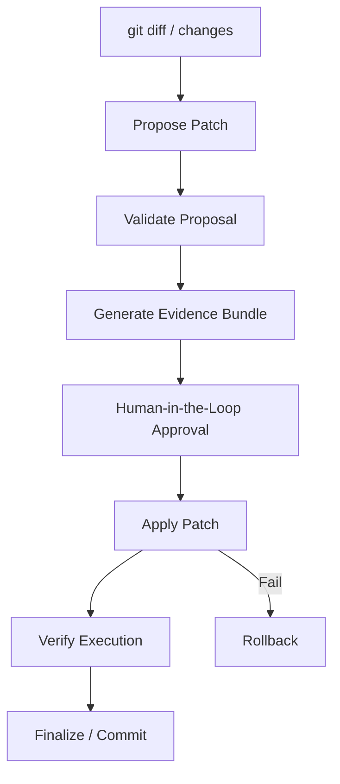

# Maximizing Proficiency in builder-II

This guide is a walkthrough of the advanced capabilities and daily workflows of builder-II. By understanding how to leverage these interfaces, model servers, and verification pipelines, you can maximize your productivity and maintain strict governance constraints.

---

## 1. Setup & Environment Readiness

### The `builder init` v2 Wizard
When configuring a workspace, `builder init` launches an interactive wizard that scans your environment and walks you through 9 essential setup decisions:

```bash
builder init
```

#### What it configures:
1. **Target Directory:** Path to the repository you want to govern.
2. **Target Profile:** Classification (`generic` | `builder` | `core`).
3. **Workspace Mode:** Mode of operation (e.g., standard, branched).
4. **Primary Persona:** Default model persona mapping.
5. **Default Verification Profile:** Verification steps for patches.
6. **Primary Model Routing:** E.g., `phi-reasoning` for speed, `qwen-coder` for heavy lifting.
7. **Execution Mode:** (`passive` | `active`).
8. **Egress Policy:** (`local_network` | `cloud_egress`).
9. **Telemetry Preferences:** Log shipping level.

#### Headless / Scripted Initialization
For automation or quick scripting, use the `--non-interactive` mode:
```bash
builder init \
  --non-interactive \
  --repo-path . \
  --target builder \
  --mode passive \
  --model qwen-coder
```

> [!TIP]
> The wizard performs a dry-run and writes a `setup_plan.json` configuration manifest. To apply it, run:
> `builder-setup apply --plan setup_plan.json`

### Verifying Environment Health
Always run `builder doctor` before starting a session to ensure all dependencies and backend connections are valid:
```bash
builder doctor
```
**Expected Success Output:**
```text
Checking workspace configuration... OK
Checking Goose runtime connection... OK
Checking local model server (localhost:11434)... OK
Checking documentation audit matrix... OK
[SUCCESS] All builder-II system gates are open!
```

---

## 2. STRATUM TUI Mastery

**STRATUM** is the Textual-based operator console. It provides real-time legibility of the governed pipeline without granting execution authority.

```
+---------------------------------------------------------------------------------+
|                                 STRATUM CONSOLE                                 |
+----------------------------------------------------+----------------------------+
|  SPINE (Artifact Chain)                            |  SIGNALS (Active State)    |
|  [x] 01_intake.json                                |  MODE: passive             |
|  [x] 02_preflight.json                             |  PROVIDER: ollama          |
|  [/] 03_patch_proposal.json                        |  MODEL: qwen-coder         |
|  [ ] 04_evidence_bundle.json                       |  GATEWAY: Local Loop       |
|  [ ] 05_receipt.json                               |                            |
+----------------------------------------------------+----------------------------+
|  CENTER (Selected Artifact Viewer)                 |  CHAIN STATUS              |
|                                                    |  Chain Valid: TRUE         |
|  {                                                 |  Integrity: PASS           |
|    "kind": "builder_ii.patch_proposal",            |                            |
|    "digest": "sha256:7f9a2b...",                   |  NEXT STEP:                |
|    "proposal": "+ func example() ..."              |  > Run validation          |
|  }                                                 |                            |
+----------------------------------------------------+----------------------------+
|  ~ [Command Composer: builder verify]                                           |
+---------------------------------------------------------------------------------+
```

### Essential Keyboard Shortcuts
* **`j` / `k` (or Arrow Keys):** Navigate up and down the spine (artifact chain).
* **`Tab` / `Shift+Tab`:** Switch focus between the Spine, Center Viewer, and Signals Panel.
* **`~` (Tilde):** Toggle the **Command Composer** input bar.
* **`?` (Question Mark):** Open the command palette and in-app keyboard shortcuts.
* **`/` (Slash):** Search the text of the selected artifact.
* **`q`:** Exit the TUI console.

### Troubleshooting: Empty or Dim Spines
If you launch STRATUM and the spine looks completely empty or dim:
1. **Explanation:** No artifacts have been generated in your workspace session directory yet. This is expected behavior for new sessions.
2. **Action:** Run a preparation command (e.g. `builder-session prepare-package`) in another terminal to kick off the session. STRATUM will auto-reload.

---

## 3. Local & Cloud Model Setup

### Setting Up a Local MLX Model Server
For local, high-performance inference on Apple Silicon, builder-II uses the `mlx-lm` framework.

1. **Install MLX community server dependencies:**
   ```bash
   pip install mlx-lm
   ```
2. **Start the server with a recommended model:**
   ```bash
   python -m mlx_lm.server --model mlx-community/Qwen2.5-Coder-7B-Instruct-4bit --port 8080
   ```
3. **Verify the connection:**
   ```bash
   curl http://localhost:8080/v1/models
   ```
4. **Configure your `.env` to route to the server:**
   ```ini
   BUILDER_MODEL_BACKEND=mlx
   BUILDER_MLX_API_URL=http://localhost:8080/v1
   ```

### Configuring Cloud Egress Providers
To route heavy reasoning workloads to Vertex AI or Groq, populate the provider credentials in your local `.env` file:

```ini
# Google Vertex AI Egress
GOOGLE_APPLICATION_CREDENTIALS=/path/to/adc-key.json
VERTEX_PROJECT_ID=my-gcp-project
VERTEX_REGION=us-central1

# Groq API Egress
GROQ_API_KEY=gsk_y2H78f...
```

### Rendering Model Routing Policies
To view how requests are currently routed based on task complexity and security constraints, run:
```bash
builder-model-policy render
```
**Sample Policy Output:**
```text
Task Category: trivial    -> Route to: local (phi-reasoning)
Task Category: complex    -> Route to: local (qwen-coder)
Task Category: egress     -> Route to: cloud (gemini-3.5-flash) [ADC Verified]
```

### The Governed `builder ask` Command
For simple model Q&A that remains subject to local telemetry, auditing, and receipt generation, run:
```bash
builder ask "Explain how the git hook enforces the verification gate." --model qwen-coder
```

---

## 4. The HITL Patch Pipeline

Every code modification flows through a rigid, multi-stage pipeline ensuring that planned work is verified before promotion.



### Step-by-Step Command Walkthrough

#### 1. Propose the patch:
Scan local changes and package them into a structured proposal:
```bash
builder-hitl propose-patch --output-dir .builder/patches/patch_01
```
#### 2. Review and approve the proposal:
Inspect the generated `patch_proposal.json` in STRATUM. Run the approval flow:
```bash
builder-hitl approve-patch .builder/patches/patch_01/patch_proposal.json
```
#### 3. Apply the patch:
Once approved, apply the diff contents to the workspace:
```bash
builder-hitl apply-patch .builder/patches/patch_01/patch_proposal.json
```
#### 4. Run the post-apply verification checks:
Verify that all unit tests and security gates are green:
```bash
builder verify
```
#### 5. Rollback (in case of failure):
If any verification gate fails, immediately restore the workspace state to the pre-patch snapshot:
```bash
builder-hitl rollback-patch .builder/patches/patch_01/patch_proposal.json
```

---

## 5. deepagents Forge & Delegation

A **deepagent** is a specialized, sandboxed subagent profile built to run designated task workloads (such as code research, database debugging, or security audits) under explicit capability gates.

### Creating a Deepagent with Forge
Run the interactive Forge wizard to construct a new deepagent profile:
```bash
builder-deepagents forge
```

#### Key Steps in the Wizard:
1. **Persona Definition:** Define the system prompt (e.g. "You are an accessibility auditor").
2. **Capability Assignment:** Grant specific MCP tool permissions or file read/write limits.
3. **Approval Boundary:** Set whether human HITL approval is required for tool executions.
4. **Verification Profile:** Bind it to a target verification suite (e.g. `pytest`).

### Running a Delegation Task
To dispatch a task to a configured deepagent, follow this workflow:

1. **Mint the delegation assignment:**
   ```bash
   builder-deepagents plan-work --agent test_writer --task "Write unit tests for cli/main.py"
   ```
2. **Approve the execution plan:**
   ```bash
   builder-deepagents approve-candidate .builder/delegations/assignment_01.json
   ```
3. **Run the agent process:**
   ```bash
   builder-deepagents run-approved .builder/delegations/assignment_01.json
   ```
4. **Review results & logs:**
   ```bash
   builder-deepagents review .builder/delegations/assignment_01.json
   ```

---

## 6. Advanced Tools & Diagnostics

### Debugging Delegation with `why`
If a deepagent delegation or orchestration decision fails, you can request a belief trace explaining the logical steps the router took:

```bash
builder-orchestration why --obligation .builder/orchestration/obligation_02.json
```

**Expected Trace Output:**
```text
Obligation Status: REFUSED
Belief Trace:
  - Checked capability gates... PASS
  - Evaluated memory context... PASS
  - Verified local model server health... FAIL (Connection refused on port 8080)
  - Result: Router refused delegation because the local backend was offline.
```

### Checking Truth Matrix Audits
To inspect the capabilities truth matrix directly (checking which gates are closed and which features are promoted), run:
```bash
builder-platform matrix
```
This prints the status of every Ladder boundary (L1 to L9) and flags any speculative capabilities that have not yet cleared their validation gates.
